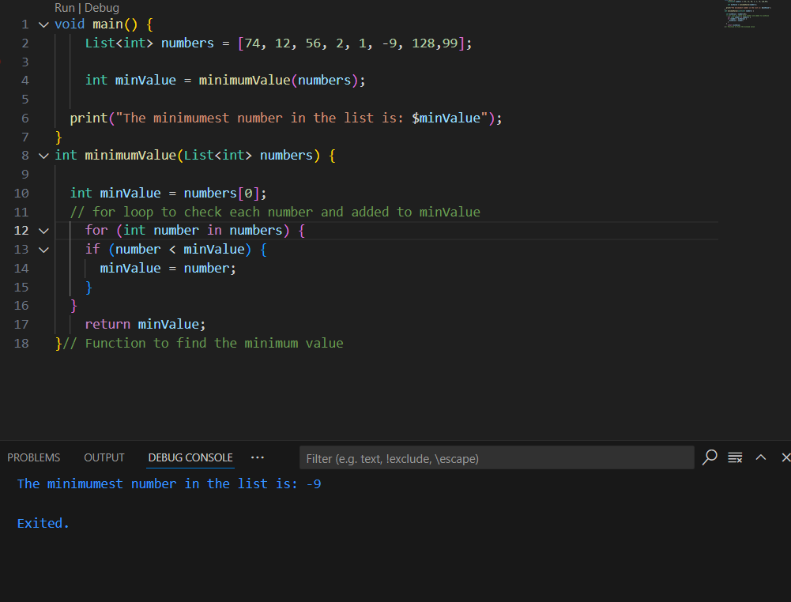

# Minimum Value Check
This Task to finds the minimum value in a list of numbers.

Added random number in list.

Made seprate function in order to find the minimum number using for loop to check every number in the list.

The final result will be added to minValue.

Output image
